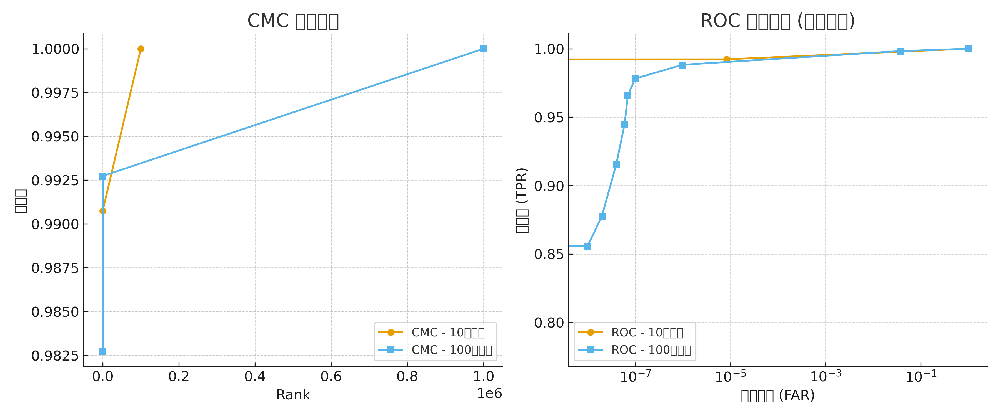

# Face Recognition and MegaFace Evaluation

## 项目概述
本项目基于 **InsightFace** 框架，提供了从 **人脸特征提取** 到 **MegaFace 数据集评估** 的完整流程。  
主要目标是验证人脸识别模型在大规模干扰人脸库中的 **识别性能 (CMC)** 和 **验证性能 (ROC)**。

## 功能特性
- 使用 **ONNX 格式的 InsightFace 模型**进行人脸特征提取  
- 支持 **FaceScrub** 和 **MegaFace** 数据集特征提取与评估  
- 提供 **噪声数据清理** 模块，自动过滤无效或错误的人脸数据  
- 完整的 **MegaFace Benchmark 测试流程**，输出 CMC/ROC 曲线及统计指标  

## 项目结构
```
.
├── FaceRecognizer.py      # ONNX 人脸特征提取器
├── gen_magaface.py        # 提取 FaceScrub / MegaFace 特征
├── remove_noises.py       # 噪声数据清理
├── devkit/
├── data/                  # 数据目录
│   ├── facescrub_lst
│   ├── megaface_lst
│   ├── facescrub_noises.txt
│   └── megaface_noises.txt
├── feature_out/           # 特征输出
├── feature_out_clean/     # 清理后的特征
├── results/               # 测试结果
├── README.md
└── model.onnx
```

## 环境要求
运行gen_magaface.py和remove_noises.py:
- Python 3.7+
- CUDA 10.2+ (可选, GPU加速)
- 依赖包：
  ```bash
  pip install onnxruntime-gpu opencv-python scikit-learn numpy
  ```
要运行run_experiments.py必须在Linux环境下，且安装了tbb_2020和opencv2.4（注意不能用较新的版本）。
## 使用方法

### 1. 数据准备
下载并准备：
- **FaceScrub** 数据集
- **MegaFace** 数据集

生成图像路径列表：
```text
data/facescrub_lst
data/megaface_lst
```

### 2. 提取特征
```bash
python gen_magaface.py     --gpu 0     --model_path ./w600k_r50.onnx     --algo buffalo_l     --facescrub-root /path/to/facescrub_images     --megaface-root /path/to/megaface_images     --facescrub-lst ./data/facescrub_lst     --megaface-lst ./data/megaface_lst     --output ./feature_out
```

### 3. 清理噪声数据
```bash
python remove_noises.py     --algo buffalo_l     --facescrub-noises ./data/facescrub_noises.txt     --megaface-noises ./data/megaface_noises.txt     --feature-dir-input ./feature_out     --feature-dir-out ./feature_out_clean
```

### 4. 运行评估
```bash
cd devkit/experiments
python3 run_experiment.py     "./feature_out_clean/megaface"     "./feature_out_clean/facescrub"     "_buffalo_l.bin"     "./results/"     -s 1000000     -p ../templatelists/facescrub_features_list.json
```

评估结果保存在 `results/` 目录。

---

## 参数说明

### FaceRecognizer.py
- `model_path`: ONNX 模型路径
- `ctx_id`: GPU ID (默认0, 设为 -1 使用CPU)

### gen_magaface.py
- `--batch_size`: 批处理大小 (默认: 8)  
- `--gpu`: GPU设备ID (默认: 0)  
- `--model_path`: 模型路径 (默认: `./w600k_r50.onnx`)  
- `--algo`: 模型名称标识 (默认: `buffalo_l`)  
- `--facescrub-root`: FaceScrub 图像路径  
- `--megaface-root`: MegaFace 图像路径  
- `--output`: 特征输出目录  

### remove_noises.py
- `--facescrub-noises`: FaceScrub 噪声列表  
- `--megaface-noises`: MegaFace 噪声列表  
- `--feature-dir-input`: 输入特征目录  
- `--feature-dir-out`: 输出目录  

---

## 实验结果 (基于 InsightFace buffalo_l)

| 指标                  | 10万干扰 | 100万干扰 |
|-----------------------|----------|-----------|
| Rank-1 CMC           | 99.08%   | 98.27%    |
| Rank-10 CMC          | ~100%    | 99.27%+   |
| TPR @ FAR = 1e-6     | 99.2%    | 97.8–98.8% |

- **识别性能**：百万级干扰下仍保持 98%+ Rank-1  
- **验证性能**：极低 FAR 下仍接近 98–99%  
- **曲线对比图**：  



---

## 许可证
Apache 2.0 License
